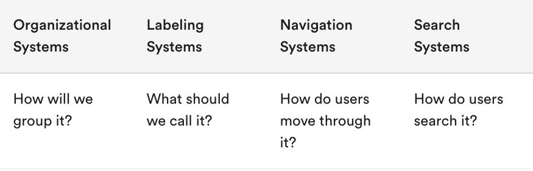

# UX Engineering Starter Pack: 

## 1: Discuss the role of information architecture in user experience design: 

- Infomation architecture (IA): 
    info a business must make available to fulfill the needs of all its users and organizing it so each user can easily meet their specific requirement at a moment in time.
- IA utilizes SEO which is driven by marketing among other things: 

### who are my stake holder: 
- 

## 2: Gain familiarity with common information architecture tools.

 ## Concept of information architecture into four systems:

 

 # System 1: Organization

 - Do not inundate user with too much informationas they can only process about 7 pieces of info at a time. 
 ### types of Organization systems: 
 - subsequesntial: 

 In sequential systems, information is presented to users in a linear, step-by-step fashion.

 think mobile apps 

 - Hierarachical: 

Top level has the has few yet most significant catogories that lead user into the bottom. 
 

 - Matrix: More specified as busniness grows: 

In a matrix structure, content can be grouped in multiple ways, and one isn’t necessarily more significant than the other (think Netflix).

## Site maps why use them? 

- It shows how the navigation should be structured.
- It helps identify where content will sit and what needs to be produced.
- It helps show the relationships between different pages.
- It provides a structure for beginning estimates for development.
- It’s a tangible IA deliverable you can show others before, while, and after content is built.
  
# System 2: Labeling

- Get different perspective on website labeling as one word can mean totally different things to different users. 

`Within a content management system, taxonomy can refer both to the hierarchical structure into which content is authored, which generally drives site organization and URL structure, as well as the metadata elements and vocabularies created for metatagging content.`

# System 3: Navigation: 

Navigation is how a user moves through a system to achieve their goal.

- Taxonomy 
Within a content management system, taxonomy can refer both to the hierarchical structure into which content is authored, which generally drives site organization and URL structure, as well as the metadata elements and vocabularies created for metatagging content.

- navigation with user flow

# System 4: Search

- users fo not typically want to engage in seraching through catogories so make it easy for them ( think reccomendation or search capability)

# Navigation is Key: 

## F-Pattern: 

- Users first read in a horizontal movement across the top of a page.
- Next, they scan the first and second paragraphs on a page.
- Finally, they look at headings or the first couple of words farther down the page.

# Content Hierarchy

user behavior can be arraged by following the CH
- Main
- Supporting 
- Interface 

# Testing With Hi-Fi Prototypes: 

- Flow of screens: What the user sees and does on the site or app.

- Motion and gestures: How the user controls the site or app.

- Timing: When the user sees content on the site or app.

- Expectations: How the content and flow support what users expect on the site or app.

# The Usability Testing Process

- Prepare a plan of three or more task scenarios that test user goals and make sure your product works correctly.
- Recruit participants who resemble your target audience.
- Conduct the usability test in a quiet place with a working prototype.
- Analyze the data to find patterns and problems.
- Debrief the test and determine next steps.

## Prepare Task Scenarios: 
 
 - What are the goals a user has when interacting with my product?
- Do I have specific questions about how my design will work in practice?
- Do I need to test a specific interaction or flow?